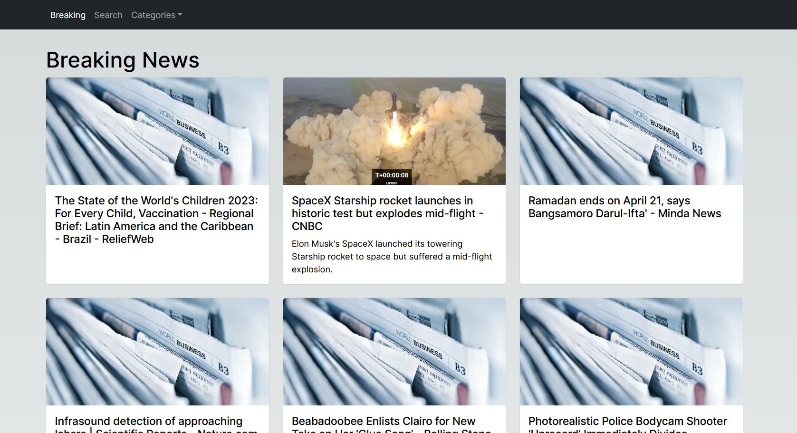

# NextJs with Typescript News Website

- This website is created using NectJS
- Implementation of typescript
- Use of NextJS pages structure
- NextJS Routing
- API Routes
- Client Side Rendering
- Use of Dynamic Routes
- getStaticProps
- getStaticPaths
- Incremental Static Generation
- 400/500 Error pages
- Use of NextJS Progress Bar
- Image Optimization using NextJS image component
